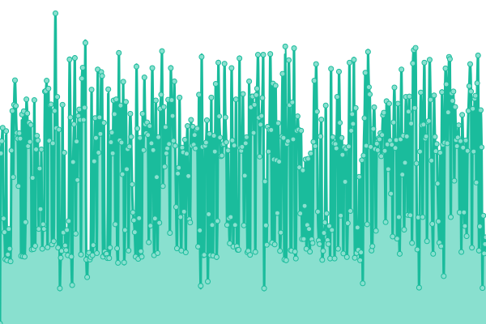
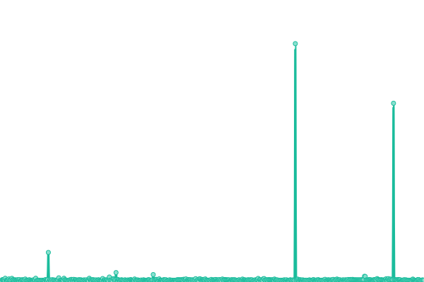
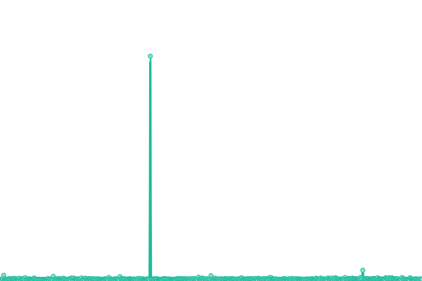
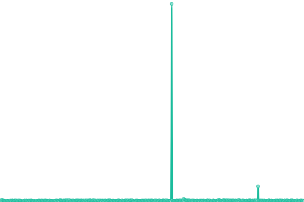

# [📈 Fuentes](https://uptime.tusdatos.co): <!--live status--> **🟧 Partial outage**

This repository contains the open-source uptime monitor and status page for [DArchemist](https://uptime.tusdatos.co), powered by [Upptime](https://github.com/upptime/upptime).

With [Upptime](https://upptime.js.org), you can get your own unlimited and free uptime monitor and status page, powered entirely by a GitHub repository. We use [Issues](https://github.com/DArchemist/Monitor-de-fuentes/issues) as incident reports, [Actions](https://github.com/DArchemist/Monitor-de-fuentes/actions) as uptime monitors, and [Pages](https://uptime.tusdatos.co) for the status page.

## [📈 Live Status](https://demo.upptime.js.org): <!--live status--> **🟧 Partial outage**

<!--start: status pages-->
<!-- This summary is generated by Upptime (https://github.com/upptime/upptime) -->
<!-- Do not edit this manually, your changes will be overwritten -->
<!-- prettier-ignore -->
| URL | Status | History | Response Time | Uptime |
| --- | ------ | ------- | ------------- | ------ |
|  [Tusdatos.co](https://www.tusdatos.co/) | Operacional | [tusdatos-co.yml](https://github.com/DArchemist/Monitor-de-fuentes-2/commits/HEAD/history/tusdatos-co.yml) | 

 346ms
     
 | 

<a href="https://uptime.tusdatos.co/history/tusdatos-co">100.00%</a>
    

|  [Tusdatos Dashboard](https://dash-board.tusdatos.co/) | Operacional | [tusdatos-dashboard.yml](https://github.com/DArchemist/Monitor-de-fuentes-2/commits/HEAD/history/tusdatos-dashboard.yml) | 

 475ms
     
 | 

<a href="https://uptime.tusdatos.co/history/tusdatos-dashboard">100.00%</a>
    

|  [Policía](https://antecedentes.policia.gov.co:7005/WebJudicial/antecedentes.xhtml) | Operacional | [policia.yml](https://github.com/DArchemist/Monitor-de-fuentes-2/commits/HEAD/history/policia.yml) | 

 934ms
     
 | 

<a href="https://uptime.tusdatos.co/history/policia">100.00%</a>
    

|  [Procuraduría](https://apps.procuraduria.gov.co/webcert/inicio.aspx?tpo=1) | Operacional | [procuraduria.yml](https://github.com/DArchemist/Monitor-de-fuentes-2/commits/HEAD/history/procuraduria.yml) | 

 500ms
     
 | 

<a href="https://uptime.tusdatos.co/history/procuraduria">100.00%</a>
    

|  [Contraloría](https://www.contraloria.gov.co/control-fiscal/responsabilidad-fiscal/certificado-de-antecedentes-fiscales) | Operacional | [contraloria.yml](https://github.com/DArchemist/Monitor-de-fuentes-2/commits/HEAD/history/contraloria.yml) | 

 655ms
     
 | 

<a href="https://uptime.tusdatos.co/history/contraloria">100.00%</a>
    

|  [RUAF](https://ruaf.sispro.gov.co/TerminosCondiciones.aspx) | Operacional | [ruaf.yml](https://github.com/DArchemist/Monitor-de-fuentes-2/commits/HEAD/history/ruaf.yml) | 

 1389ms
     
 | 

<a href="https://uptime.tusdatos.co/history/ruaf">100.00%</a>
    

|  [RUES](https://www.rues.org.co/) | Operacional | [rues.yml](https://github.com/DArchemist/Monitor-de-fuentes-2/commits/HEAD/history/rues.yml) | 

 304ms
     
 | 

<a href="https://uptime.tusdatos.co/history/rues">100.00%</a>
    

|  [RUNT](https://www.runt.com.co/consultaCiudadana/#/consultaPersona) | No Operacional | [runt.yml](https://github.com/DArchemist/Monitor-de-fuentes-2/commits/HEAD/history/runt.yml) | 

 0ms
     
 | 

<a href="https://uptime.tusdatos.co/history/runt">0.00%</a>
    

|  [PEP](https://apps.migracioncolombia.gov.co/consultarVEN/) | Operacional | [pep.yml](https://github.com/DArchemist/Monitor-de-fuentes-2/commits/HEAD/history/pep.yml) | 

 1065ms
     
 | 

<a href="https://uptime.tusdatos.co/history/pep">99.78%</a>
    

|  [DIAN RUT](https://muisca.dian.gov.co/WebArquitectura/DefLoginOld.faces) | Operacional | [dian-rut.yml](https://github.com/DArchemist/Monitor-de-fuentes-2/commits/HEAD/history/dian-rut.yml) | 

 2759ms
     
 | 

<a href="https://uptime.tusdatos.co/history/dian-rut">100.00%</a>
    

|  [Rama Judicial](https://consultaprocesos.ramajudicial.gov.co/Procesos/NombreRazonSocial) | Operacional | [rama-judicial.yml](https://github.com/DArchemist/Monitor-de-fuentes-2/commits/HEAD/history/rama-judicial.yml) | 

 921ms
     
 | 

<a href="https://uptime.tusdatos.co/history/rama-judicial">96.76%</a>
    

|  [JEPMS Armenia](https://procesos.ramajudicial.gov.co/jepms/armeniajepms/conectar.asp) | Operacional | [jepms-armenia.yml](https://github.com/DArchemist/Monitor-de-fuentes-2/commits/HEAD/history/jepms-armenia.yml) | 

 2013ms
     
 | 

<a href="https://uptime.tusdatos.co/history/jepms-armenia">72.01%</a>
    

|  [JEPMS Barranquilla](https://procesos.ramajudicial.gov.co/jepms/barranquillajepms/conectar.asp) | Operacional | [jepms-barranquilla.yml](https://github.com/DArchemist/Monitor-de-fuentes-2/commits/HEAD/history/jepms-barranquilla.yml) | 

 375ms
     
 | 

<a href="https://uptime.tusdatos.co/history/jepms-barranquilla">87.31%</a>
    

|  [JEPMS Bogotá](https://procesos.ramajudicial.gov.co/jepms/bogotajepms/conectar.asp) | Operacional | [jepms-bogota.yml](https://github.com/DArchemist/Monitor-de-fuentes-2/commits/HEAD/history/jepms-bogota.yml) | 

 205ms
     
 | 

<a href="https://uptime.tusdatos.co/history/jepms-bogota">75.41%</a>
    

|  [JEPMS Bucaramanga](https://procesos.ramajudicial.gov.co/jepms/bucaramangajepms/conectar.asp) | Operacional | [jepms-bucaramanga.yml](https://github.com/DArchemist/Monitor-de-fuentes-2/commits/HEAD/history/jepms-bucaramanga.yml) | 

 180ms
     
 | 

<a href="https://uptime.tusdatos.co/history/jepms-bucaramanga">80.04%</a>
    

|  [JEPMS Buga](https://procesos.ramajudicial.gov.co/jepms/bugajepms/conectar.asp) | Operacional | [jepms-buga.yml](https://github.com/DArchemist/Monitor-de-fuentes-2/commits/HEAD/history/jepms-buga.yml) | 

 186ms
     
 | 

<a href="https://uptime.tusdatos.co/history/jepms-buga">80.83%</a>
    

|  [JEPMS Cali](https://procesos.ramajudicial.gov.co/jepms/calijepms/conectar.asp) | Operacional | [jepms-cali.yml](https://github.com/DArchemist/Monitor-de-fuentes-2/commits/HEAD/history/jepms-cali.yml) | 

 205ms
     
 | 

<a href="https://uptime.tusdatos.co/history/jepms-cali">56.29%</a>
    

|  [JEPMS Cartagena](https://procesos.ramajudicial.gov.co/jepms/cartagenajepms/conectar.asp) | Operacional | [jepms-cartagena.yml](https://github.com/DArchemist/Monitor-de-fuentes-2/commits/HEAD/history/jepms-cartagena.yml) | 

 193ms
     
 | 

<a href="https://uptime.tusdatos.co/history/jepms-cartagena">62.02%</a>
    

|  [JEPMS Florencia](https://procesos.ramajudicial.gov.co/jepms/florenciajepms/conectar.asp) | Operacional | [jepms-florencia.yml](https://github.com/DArchemist/Monitor-de-fuentes-2/commits/HEAD/history/jepms-florencia.yml) | 

 494ms
     
 | 

<a href="https://uptime.tusdatos.co/history/jepms-florencia">80.34%</a>
    

|  [JEPMS Ibagué](https://procesos.ramajudicial.gov.co/jepms/ibaguejepms/conectar.asp) | Operacional | [jepms-ibague.yml](https://github.com/DArchemist/Monitor-de-fuentes-2/commits/HEAD/history/jepms-ibague.yml) | 

 194ms
     
 | 

<a href="https://uptime.tusdatos.co/history/jepms-ibague">65.50%</a>
    

|  [JEPMS Manizales](https://procesos.ramajudicial.gov.co/jepms/manizalesjepms/conectar.asp) | Operacional | [jepms-manizales.yml](https://github.com/DArchemist/Monitor-de-fuentes-2/commits/HEAD/history/jepms-manizales.yml) | 

 254ms
     
 | 

<a href="https://uptime.tusdatos.co/history/jepms-manizales">73.68%</a>
    

|  [JEPMS Medellín](https://procesos.ramajudicial.gov.co/jepms/medellinjepms/conectar.asp) | Operacional | [jepms-medellin.yml](https://github.com/DArchemist/Monitor-de-fuentes-2/commits/HEAD/history/jepms-medellin.yml) | 

 184ms
     
 | 

<a href="https://uptime.tusdatos.co/history/jepms-medellin">56.51%</a>
    

|  [JEPMS Montería](https://procesos.ramajudicial.gov.co/jepms/monteriajepms/conectar.asp) | Operacional | [jepms-monteria.yml](https://github.com/DArchemist/Monitor-de-fuentes-2/commits/HEAD/history/jepms-monteria.yml) | 

 192ms
     
 | 

<a href="https://uptime.tusdatos.co/history/jepms-monteria">65.00%</a>
    

|  [JEPMS Neiva](https://procesos.ramajudicial.gov.co/jepms/neivajepms/conectar.asp) | Operacional | [jepms-neiva.yml](https://github.com/DArchemist/Monitor-de-fuentes-2/commits/HEAD/history/jepms-neiva.yml) | 

 238ms
     
 | 

<a href="https://uptime.tusdatos.co/history/jepms-neiva">72.10%</a>
    

|  [JEPMS Palmira](https://procesos.ramajudicial.gov.co/jepms/palmirajepms/conectar.asp) | Operacional | [jepms-palmira.yml](https://github.com/DArchemist/Monitor-de-fuentes-2/commits/HEAD/history/jepms-palmira.yml) | 

 182ms
     
 | 

<a href="https://uptime.tusdatos.co/history/jepms-palmira">56.53%</a>
    

|  [JEPMS Pasto](https://procesos.ramajudicial.gov.co/jepms/pastojepms/conectar.asp) | Operacional | [jepms-pasto.yml](https://github.com/DArchemist/Monitor-de-fuentes-2/commits/HEAD/history/jepms-pasto.yml) | 

 177ms
     
 | 

<a href="https://uptime.tusdatos.co/history/jepms-pasto">56.53%</a>
    

|  [JEPMS Pereira](https://procesos.ramajudicial.gov.co/jepms/pereirajepms/conectar.asp) | Operacional | [jepms-pereira.yml](https://github.com/DArchemist/Monitor-de-fuentes-2/commits/HEAD/history/jepms-pereira.yml) | 

 178ms
     
 | 

<a href="https://uptime.tusdatos.co/history/jepms-pereira">56.55%</a>
    

|  [JEPMS Popayán](https://procesos.ramajudicial.gov.co/jepms/popayanjepms/conectar.asp) | Operacional | [jepms-popayan.yml](https://github.com/DArchemist/Monitor-de-fuentes-2/commits/HEAD/history/jepms-popayan.yml) | 

 186ms
     
 | 

<a href="https://uptime.tusdatos.co/history/jepms-popayan">56.55%</a>
    

|  [JEPMS Quibdó](https://procesos.ramajudicial.gov.co/jepms/quibdojepms/conectar.asp) | Operacional | [jepms-quibdo.yml](https://github.com/DArchemist/Monitor-de-fuentes-2/commits/HEAD/history/jepms-quibdo.yml) | 

 205ms
     
 | 

<a href="https://uptime.tusdatos.co/history/jepms-quibdo">39.89%</a>
    

|  [JEPMS Tunja](https://procesos.ramajudicial.gov.co/jepms/tunjajepms/conectar.asp) | Operacional | [jepms-tunja.yml](https://github.com/DArchemist/Monitor-de-fuentes-2/commits/HEAD/history/jepms-tunja.yml) | 

 172ms
     
 | 

<a href="https://uptime.tusdatos.co/history/jepms-tunja">56.56%</a>
    

|  [JEPMS Villavicencio](https://procesos.ramajudicial.gov.co/jepms/villavicenciojepms/conectar.asp) | Operacional | [jepms-villavicencio.yml](https://github.com/DArchemist/Monitor-de-fuentes-2/commits/HEAD/history/jepms-villavicencio.yml) | 

 734ms
     
 | 

<a href="https://uptime.tusdatos.co/history/jepms-villavicencio">52.55%</a>
    

<!--end: status pages-->

[**Visit our status website →**](https://uptime.tusdatos.co)

## 📄 License

- Powered by: [Upptime](https://github.com/upptime/upptime)
- Code: [MIT](./LICENSE) © [DArchemist](https://uptime.tusdatos.co)
- Data in the `./history` directory: [Open Database License](https://opendatacommons.org/licenses/odbl/1-0/)
