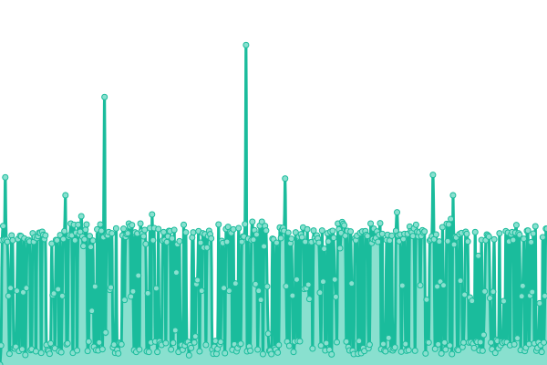
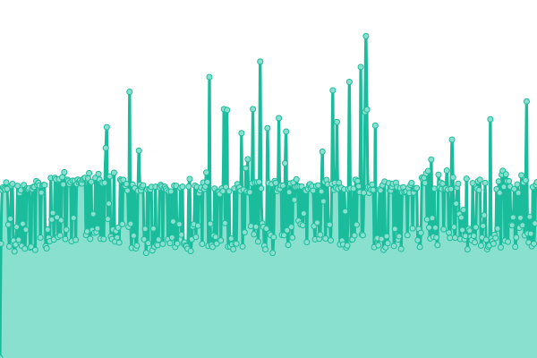

# [📈 Fuentes](https://uptime.tusdatos.co): <!--live status--> **🟧 Partial outage**

This repository contains the open-source uptime monitor and status page for [DArchemist](https://uptime.tusdatos.co), powered by [Upptime](https://github.com/upptime/upptime).

With [Upptime](https://upptime.js.org), you can get your own unlimited and free uptime monitor and status page, powered entirely by a GitHub repository. We use [Issues](https://github.com/DArchemist/Monitor-de-fuentes/issues) as incident reports, [Actions](https://github.com/DArchemist/Monitor-de-fuentes/actions) as uptime monitors, and [Pages](https://uptime.tusdatos.co) for the status page.

## [📈 Live Status](https://demo.upptime.js.org): <!--live status--> **🟧 Partial outage**

<!--start: status pages-->
<!-- This summary is generated by Upptime (https://github.com/upptime/upptime) -->
<!-- Do not edit this manually, your changes will be overwritten -->
<!-- prettier-ignore -->
| URL | Status | History | Response Time | Uptime |
| --- | ------ | ------- | ------------- | ------ |
|  [Tusdatos.co](https://www.tusdatos.co/) | Operacional | [tusdatos-co.yml](https://github.com/DArchemist/Monitor-de-fuentes-2/commits/HEAD/history/tusdatos-co.yml) | 

 268ms
     
 | 

<a href="https://uptime.tusdatos.co/history/tusdatos-co">100.00%</a>
    

|  [Tusdatos Dashboard](https://dash-board.tusdatos.co/) | Operacional | [tusdatos-dashboard.yml](https://github.com/DArchemist/Monitor-de-fuentes-2/commits/HEAD/history/tusdatos-dashboard.yml) | 

 366ms
     
 | 

<a href="https://uptime.tusdatos.co/history/tusdatos-dashboard">100.00%</a>
    

|  [Policía](https://antecedentes.policia.gov.co:7005/WebJudicial/antecedentes.xhtml) | Operacional | [policia.yml](https://github.com/DArchemist/Monitor-de-fuentes-2/commits/HEAD/history/policia.yml) | 

 833ms
     
 | 

<a href="https://uptime.tusdatos.co/history/policia">100.00%</a>
    

|  [Procuraduría](https://apps.procuraduria.gov.co/webcert/inicio.aspx?tpo=1) | Operacional | [procuraduria.yml](https://github.com/DArchemist/Monitor-de-fuentes-2/commits/HEAD/history/procuraduria.yml) | 

 332ms
     
 | 

<a href="https://uptime.tusdatos.co/history/procuraduria">100.00%</a>
    

|  [Contraloría](https://www.contraloria.gov.co/control-fiscal/responsabilidad-fiscal/certificado-de-antecedentes-fiscales) | Operacional | [contraloria.yml](https://github.com/DArchemist/Monitor-de-fuentes-2/commits/HEAD/history/contraloria.yml) | 

 831ms
     
 | 

<a href="https://uptime.tusdatos.co/history/contraloria">100.00%</a>
    

|  [RUAF](https://ruaf.sispro.gov.co/TerminosCondiciones.aspx) | No Operacional | [ruaf.yml](https://github.com/DArchemist/Monitor-de-fuentes-2/commits/HEAD/history/ruaf.yml) | 

 0ms
     
 | 

<a href="https://uptime.tusdatos.co/history/ruaf">0.05%</a>
    

|  [RUES](https://www.rues.org.co/) | Operacional | [rues.yml](https://github.com/DArchemist/Monitor-de-fuentes-2/commits/HEAD/history/rues.yml) | 

 182ms
     
 | 

<a href="https://uptime.tusdatos.co/history/rues">100.00%</a>
    

|  [RUNT](https://www.runt.com.co/consultaCiudadana/#/consultaPersona) | Operacional | [runt.yml](https://github.com/DArchemist/Monitor-de-fuentes-2/commits/HEAD/history/runt.yml) | 

 614ms
     
 | 

<a href="https://uptime.tusdatos.co/history/runt">100.00%</a>
    

|  [PEP](https://apps.migracioncolombia.gov.co/consultarVEN/) | Operacional | [pep.yml](https://github.com/DArchemist/Monitor-de-fuentes-2/commits/HEAD/history/pep.yml) | 

 1032ms
     
 | 

<a href="https://uptime.tusdatos.co/history/pep">100.00%</a>
    

|  [DIAN RUT](https://muisca.dian.gov.co/WebArquitectura/DefLoginOld.faces) | Operacional | [dian-rut.yml](https://github.com/DArchemist/Monitor-de-fuentes-2/commits/HEAD/history/dian-rut.yml) | 

 1364ms
     
 | 

<a href="https://uptime.tusdatos.co/history/dian-rut">100.00%</a>
    

<!--end: status pages-->

[**Visit our status website →**](https://uptime.tusdatos.co)

## 📄 License

- Powered by: [Upptime](https://github.com/upptime/upptime)
- Code: [MIT](./LICENSE) © [DArchemist](https://uptime.tusdatos.co)
- Data in the `./history` directory: [Open Database License](https://opendatacommons.org/licenses/odbl/1-0/)
